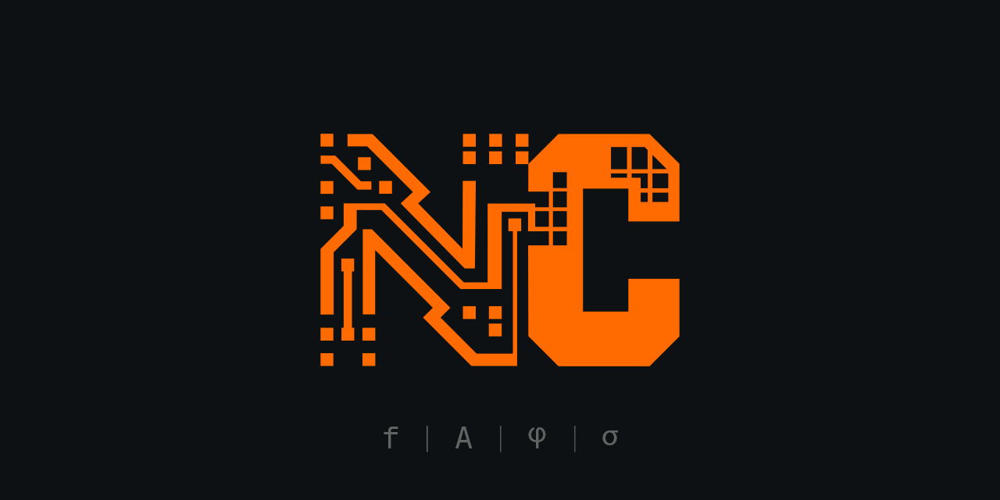

<p align="center">
  
</p>

# New Code

**A machine-native language for human–AI collaboration. v1.0.**

*Daniel Rodríguez Suárez · UltraNarrative LTD · April 2026*

---

This is New Code, the language proposed in the [working specification](./New_Code.md), at v1.0. It is no longer a prototype: the surface syntax is parsed by a real expression grammar, declarations are compiled by an explicit online/offline split with deterministic snapshot replay, every compiled body carries content-addressable provenance, the host (Python) is reachable through a typed FFI surface, and the same source compiles, runs, and is editable from a stdlib-only Language Server.

The core bet has not changed: code in its current form is a compromise artefact, optimised for a human reader at the moment when the primary writer and reader of code is about to become an AI system. New Code is written for that system. Humans write the **intent** block; the compiler produces the body; we interpret the result the way a doctor interprets blood work — through diagnostics, types, and components, not through fluent reading.

The 𝕎 type is not an audio primitive. It is the minimum description of anything that changes — how often, how much, where in the cycle, what form. Operators, processes, entanglements, and intent-driven compilation are domain-neutral.

## What v1.0 contains

- **The 𝕎 primitive.** Four components: `f`, `A`, `phi`, `sigma`. Destructurable. Realisable at any t.
- **Shapes.** `sine`, `sq`, `tri`, `saw`, `pulse(duty)`. New shapes are any unit-periodic callable.
- **Operators.** `⊕` (superpose), `⊚` (oscillate), `⇝` (drift), `⌊·⌉` (collapse), `⟪·,·⟫` (coherence), `d_γ` (coherence distance), `⁻` (phase inversion), plus alternative collapse maps (`_amp`, `_freq`, `_rms`).
- **Processes.** Ongoing unfolding with their own τ. Constructors (`every`, `on`, `while_`), combinators (series ▶, parallel ∥, feedback ↺), the `unfold` runtime.
- **Entanglement.** Declarable coupling between pairs. Transformations propagate via Φ. Non-transitive by construction.
- **Real expression grammar.** Lexer, parser, AST, and Python lowering for the body of every `fn`/`process`/`let`. Supports `let-in`, `if-then-else`, lambdas (`\x -> …`), block expressions (`{ … }`), records, lists, calls, attribute & index, the operator set above, and an explicit `python { … }` escape hatch when the host is needed inline. Lives in [`expr.py`](newcode/expr.py).
- **Stdlib + FFI.** Math, list, string, IO (captured), and a typed host bridge (`host_load`, `host_call`). `extern python { … }` blocks let a score pull in NumPy or any other Python library at the top level. Every body is compiled with the same scope the REPL uses, so what you see in `:scope` is what the compiler sees.
- **Modules + imports.** `module x.y` declarations and `import path.to.module [as alias]` statements. Module declarations install their inner declarations into the loading scope.
- **Compiler with three backends.**
  - `OfflineCompiler` — deterministic pattern matcher. Default when offline.
  - `AnthropicCompiler` — calls Claude. Validates the response through a syntax/AST/safety pass and a constraint report. Caches accepted bodies in a `SnapshotStore`.
  - `SnapshotCompiler` — replays a recorded `SnapshotStore` from disk. Used by tests for deterministic LLM exercise.
- **Online / offline / snapshot mode.** Picked from `--offline` / `--online` / `--snapshot[=path]` flags, the `NEWCODE_MODE` environment variable, or auto-selection based on `ANTHROPIC_API_KEY`. Intent holes raise a clear `OfflineHoleError` with a fix-it message in offline mode.
- **Provenance + approval workflow.** Every `Compiled` artefact carries `Provenance(backend, model, intent_hash, body_hash, timestamp, accepted, notes)`. The REPL exposes `:provenance`, `:accept`, `:reject`. Accepting a body persists it to the snapshot store; from then on the same intent compiles deterministically without an API call.
- **REPL.** Loads `.nc` files, evaluates `let` bindings through the New Code expression grammar (with a Python fallback when needed), and exposes `:src`, `:intent`, `:explain`, `:provenance`, `:accept`, `:reject`, `:mode`, `:unfold`, `:debug`, `:clear`. Run with `--offline`, `--online`, or `--snapshot[=<path>]`.
- **Visual debugger.** Browser-based SVG timeline. Processes render as horizontal bands, their realisations plotted against their internal τ; entangled pairs flash when Φ fires. Stdlib-only HTTP + Server-Sent-Events server, single-file frontend, no build step. Open from the REPL with `:debug`.
- **Browser playground.** Same idea as the debugger: stdlib HTTP server, single-page frontend, no install. Compile, run, accept, replay — all in the browser. `python -m newcode.playground`.
- **Language server.** Stdlib-only LSP in [`newcode/lsp.py`](newcode/lsp.py). Diagnostics from the parser, completion over stdlib / shapes / clause keywords / declaration keywords, hover with intent blocks on user declarations and docs on stdlib names, document symbols. The VS Code extension in [`vscode-newcode/`](vscode-newcode/) ships a TextMate grammar for `extern`, `import`, the new expression forms, and the operator set.
- **Conductor's guide + grammar lock + semantics lock.** [`GUIDE.md`](GUIDE.md), [`GRAMMAR.md`](GRAMMAR.md), and [`SEMANTICS.md`](SEMANTICS.md). When parser / LSP / VS Code grammar disagree, GRAMMAR.md wins.

## What is still intentionally incomplete

- **Formal verification of natural-language intent.** The compiler produces code that *probably* satisfies the intent; it does not prove it. The constraint report is a check, not a proof. This is the open problem at the heart of the spec; v1.0 narrows it (snapshots make compilation reproducible; provenance makes acceptance auditable) but does not solve it.
- **Streaming primitives.** `await`, full `evolving`, time-varying continuations. The semantics lock describes what is implemented today; the rest awaits a v2.
- **Graph-scale entanglement.** Pairs are first-class; n-ary coupling networks are not.

## Installing

Python 3.10+ is required.

Straight from GitHub (no clone):

```bash
pip install git+https://github.com/ultracreative/new-code.git
```

Or clone and install editable, which is the right path if you want to hack on the language itself:

```bash
git clone https://github.com/ultracreative/new-code.git
cd new-code
pip install -e .
```

Either form puts the `newcode` and `newcode-lsp` commands on your `$PATH`.

For Anthropic-backend compilation (recommended — this is the main story), also:

```bash
export ANTHROPIC_API_KEY=sk-...
pip install anthropic
```

Without a key, the REPL falls back to the offline pattern matcher, which only handles a small set of known intents.

## Running

Tests:

```bash
python3 -m unittest discover -s tests
```

REPL:

```bash
python -m newcode.repl                          # auto-mode (online if API key, else offline)
python -m newcode.repl --offline examples/demo.nc
python -m newcode.repl --online  examples/demo.nc
python -m newcode.repl --snapshot=tests/fixtures/snap.json examples/demo.nc
```

Browser playground:

```bash
python -m newcode.playground                    # opens http://127.0.0.1:<port>/
```

Visual debugger (from inside the REPL):

```text
nc> :debug
debugger at http://127.0.0.1:<port>/  (tracking 2 process(es), 1 entangled pair(s); +3 new this call)
```

## The approval workflow

A typical loop with the v1.0 compiler looks like this:

```text
$ python -m newcode.repl --online examples/demo.nc
loading examples/demo.nc...
  let concert_a = ⟨440, 1.0, 0, sine⟩
  compiled: amplify  (compiled by claude-sonnet-4-5, 0 retries)
nc> :src amplify
    f_, A_, phi_, sigma_ = signal.unpack()
    return W(f=f_, A=A_ * gain, phi=phi_, sigma=sigma_)
nc> :provenance amplify
  amplify:
    backend     : anthropic
    model       : claude-sonnet-4-5
    intent_hash : 7c9e3a2b4f8d1e6a
    body_hash   : 9d4a7e2c1b3f6580
    timestamp   : 2026-04-24T18:32:11+00:00
    accepted    : False
    notes       : 0 retries
nc> :accept amplify
  ✓ amplify accepted (intent_hash=7c9e3a2b4f8d1e6a, snapshot=~/.newcode/snapshots/default.json)
```

From the next run on, the same source compiles in `--snapshot` mode (or `--online` with the cache) without an API call. Tests can pin a snapshot file under version control and replay deterministically in CI.

## Offline vs online vs snapshot

| Mode      | Intent holes                              | Explicit bodies | Network |
|-----------|-------------------------------------------|-----------------|---------|
| offline   | offline pattern matcher only; clear error if no match | yes | no |
| online    | Anthropic API + AST safety + cache write   | yes             | yes     |
| snapshot  | replay `SnapshotStore` from disk           | yes             | no      |

`--offline` is the default when no API key is present. `--online` requires `ANTHROPIC_API_KEY`. `--snapshot=<path>` (or `:mode snapshot` in the REPL) replays a recorded session.

## Writing scores

Read **[GUIDE.md](./GUIDE.md)** first. It is the conductor's guide — a tutorial that takes you from 𝕎 to your first running score, through processes, entanglement, the new expression grammar, and the approval workflow.

The formal grammar lives in **[GRAMMAR.md](./GRAMMAR.md)**. Parser, LSP, and TextMate grammar all agree on it; when any of them diverges, that file wins.

The locked runtime model lives in **[SEMANTICS.md](./SEMANTICS.md)**. Read that file for the precise answer to questions like "does `𝕎` change over `tau`?" or "how does `:accept` change subsequent compiles?".

## Editor support

The Language Server (`python -m newcode.lsp`) is pure stdlib Python and speaks JSON-RPC over stdio. Any editor that speaks LSP can point at it. The VS Code extension under [`vscode-newcode/`](vscode-newcode/) ships:

- TextMate grammar covering decl keywords, intent / forbid / ensure / requires / emits / consumes / guard clauses, `import`, `extern python { … }`, the operator set, intent strings (corner-bracket and ASCII), and the new expression forms (let-in, lambdas, blocks, records).
- The LSP client wired to `python -m newcode.lsp`.
- Configurable corner-bracket insertion command.

```bash
cd vscode-newcode
npm install
# Open the repo root in VS Code, press F5.
```

## File layout

```
new-code/
├── newcode/
│   ├── __init__.py           top-level exports
│   ├── wave.py               the 𝕎 type and its operators
│   ├── process.py            processes and combinators
│   ├── entanglement.py       coupled pairs
│   ├── parser.py             top-level surface syntax → AST
│   ├── expr.py               expression grammar: lexer, parser, AST, lowering, evaluator
│   ├── stdlib.py             the standard library; the scope every body sees
│   ├── compiler.py           AST → callable; offline/anthropic/snapshot backends; provenance
│   ├── constraint_check.py   post-compile constraint report
│   ├── debugger.py           Tracer, SSE server, embedded SVG frontend
│   ├── lsp.py                Language Server (JSON-RPC over stdio)
│   ├── playground.py         browser playground (stdlib HTTP, single-page frontend)
│   └── repl.py               the interactive shell
├── tests/
│   ├── test_core.py          54 tests covering wave/process/entanglement/parser/compiler/debugger/LSP
│   └── test_v1.py            35 tests covering provenance / snapshot / offline-error / let-through-expr / approval workflow / v1.0 LSP additions / playground engine + HTTP shell
├── examples/
│   ├── demo.nc
│   ├── entangled_interface_lab.nc
│   └── run_entangled_interface_lab.py
├── vscode-newcode/           VS Code extension (TextMate grammar + LSP client)
├── GUIDE.md                  the conductor's guide — tutorial for writing scores
├── GRAMMAR.md                formal EBNF of the v1.0 surface syntax
├── SEMANTICS.md              locked runtime semantics for v1.0
├── pyproject.toml
└── README.md
```

## A note on where this sits

The first review's two recommendations were "narrow to audio" and "fake the AI compiler." One of those is right. The compiler in v1.0 is a real LLM call when online, with AST-level safety checks, a constraint report, and a content-addressable cache that turns yesterday's online run into today's offline replay. That is the honest version of what the specification describes.

The other recommendation misses the bet. New Code is not a DSL for signal processing. The 𝕎 primitive looks audio-specific because audio is the domain where four-component waveform structure is already native vocabulary, but the abstraction generalises: a UI state, a belief, a transaction, a database stream — all have frequency, amplitude, phase, and shape as latent components. What makes New Code worth building is the claim that this structure is universal, that intent is a first-class declaration, and that the combination kills categories of bug that conventional languages cannot name.

v1.0 is the version you can build with. Everything from here is widening — more shapes, more couplings, more streaming primitives, formal intent verification when that becomes a solved problem — not deepening the bet.
